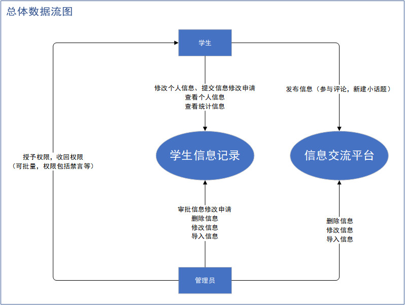
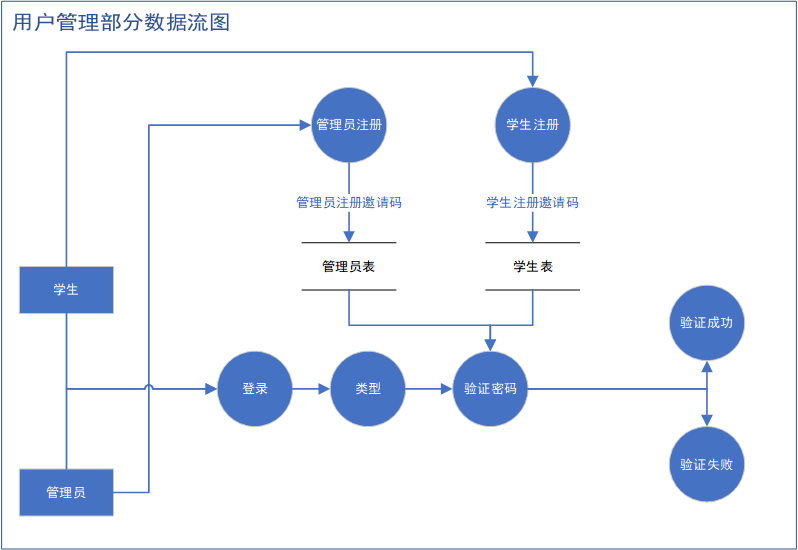
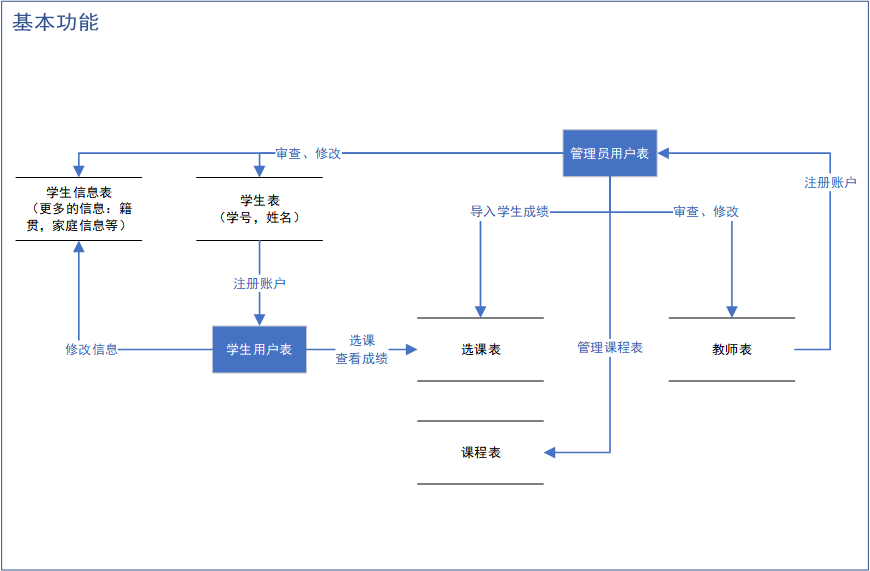

# 《数据库系统原理》大作业系统设计报告

## 题目名称：学生信息平台系统

学号及姓名：

21231120 谢辉

21231117 吕佳辉

21231121 刘尚鹭

#### 组内同学承担任务说明

| 工作内容                 | 负责学生 | 备注（暂定）                 | 工作占比 |
| ------------------------ | -------- | ---------------------------- | -------- |
| 系统功能设计与数据库设计 | 谢辉     | 总体需求和设计，协助具体实现 |          |
| 系统后端开发             | 刘尚鹭   | 后端开发和部署               |          |
| 系统前端开发             | 吕佳辉   | 前端开发实现                 |          |

## 目录

[一、需求分析](#一、需求分析)

​	[1.1.需求描述](#1.1.需求描述)

​	[1.2.数据流图](#1.2.数据流图)

​	[1.3.数据元素表](#1.3.数据元素表)

[二、数据库概念模式设计](#二、数据库概念模式设计)

​	[2.1.实体ER图](#2.1.实体ER图)

​	[2.2.关系ER图](#2.2.关系ER图)

​	[2.3.总体ER图](#2.3.总体ER图)

[三、数据库逻辑模式设计](#三、数据库逻辑模式设计)

​	[3.1.数据库关系模式](#3.1.数据库关系模式)

​	[3.2.关系模式范式等级的判定与规范](#3.2.关系模式范式等级的判定与规范)

​	[3.3.数据库设计优化](#3.3.数据库设计优化)

## 一、需求分析

### 1.1.需求描述

笔者在两年多的大学生活中，参与过不少学生工作，深感学生工作的繁琐与重复性劳动繁多，信息往往多次收集，往往需要补充之前的信息收集中不充分的部分，但却需要重复填写所有信息。同时，信息的不充分流动也是我们学习生活中的常见现象，各种信息零散在各个平台，学生很容易忽略掉，乃指不知道某处的信息。

因此，我们团队打算设计一个学习信息平台系统，一方面帮助辅导员、学生干部管理、收集、提取信息，一方面让学生能通过该系统提交信息，也能从中获取集成后的，丰富的，共享的信息。

该系统有以下几个主要功能应对同学们学习生活中常见的需要信息的场景：

1.学生基本信息的管理功能：学生拥有查看自己信息，以及经过管理员审核后修改信息的权限。基本信息包括学号，籍贯，家庭信息，宿舍房号等。

2.学生学习相关信息：学生的选课情况，学分情况，学习成绩，竞赛获奖等。

3.学生其他相关信息：学生的社会实践活动参与情况，志愿时长，社团情况，学生工作经历等

4.课程、老师、竞赛、培养方案等其他信息：学生可以留下对课程、老师、竞赛等的评价，或者分享经验，学习资源等。学生可以查看自己在培养方案上的进度。管理员可以维护学校认证的竞赛，只有这些竞赛才可以填入学生学习相关信息中竞赛获奖一项中。

总体而言，希望面向全体学生，以及辅导员等，开发一个**需求集成，功能强大，数据安全**的一站式学生信息平台，使学生的信息管理更加简便，信息流通更加自由，更能满足同学们大学生活中的信息需求。

学生信息平台应该有三种用户：一种是管理员，一种是学生干部，一种是学生。

管理员拥有最高的权限，只有管理员可以修改、增加受认可的竞赛项目，社团，学生学习成绩等第三方信息。学生修改自己的信息在一般情况下也需要管理员审批，管理员可以指定一段时间，学生可以自由修改个人信息。

学生干部是学生的一部分，但学生干部在查看信息，统计信息上拥有更高的权限，这些权限都是由管理员赋予的。

学生默认权限下只能查看个人信息，申请式修改个人信息，可以查看公众信息的统计部分，可以自由在课程评价，竞赛评价，资源分享，经验分享等地方发言。

本系统的最终目标是打造一个真正能用的关系数据库管理系统，用在班级以后的学生工作中。

### 1.2.数据流图

考虑**迭代式开发**，先实现一个基本的平台功能，实现对学生基本信息的数据管理（可Excel导入导出，审核）、数据展示、业务功能（选课）、统计分析（成绩）、安全防护（多类别用户注册，登录，权限管理）功能。

再补充开发竞赛，社会实践，志愿活动等信息的记录，以及对课程等评价的交流平台。

### 1.3.数据元素表

| 学生表   | 数据类型    | 其他           | 说明 |
| -------- | ----------- | -------------- | ---- |
| stu_id   | varchar(8)  | 不可为空，主键 | 学号 |
| stu_name | varchar(20) | 不可为空       | 姓名 |

| 教师表        | 数据类型    | 其他 | 说明 |
| ------------- | ----------- | ---- | ---- |
| teacher_id    | varchar(8)  |      |      |
| tearcher_name | varchar(20) |      |      |

| 学生用户表    | 数据类型 | 其他 | 说明   |
| ------------- | -------- | ---- | ------ |
| stu_id        |          |      | 学号   |
| stu_user_name |          |      | 用户名 |
| pwd           |          |      | 密码   |

| 管理员用户表      | 数据类型 | 其他 | 说明 |
| ----------------- | -------- | ---- | ---- |
| teacher_id        |          |      |      |
| teacher_user_name |          |      |      |
| pwd               |          |      |      |

| 课程表           | 数据类型 | 其他 | 说明 |
| ---------------- | -------- | ---- | ---- |
| class_id         |          |      |      |
| class_name       |          |      |      |
| class_teacher_id |          |      |      |
| class_time       |          |      |      |

| 选课表      | 数据类型 | 其他 | 说明 |
| ----------- | -------- | ---- | ---- |
| class_id    |          |      |      |
| stu_id      |          |      |      |
| class_grade |          |      |      |

| 学生信息表 | 数据类型 | 其他 | 说明 |
| ---------- | -------- | ---- | ---- |
| stu_id     |          |      |      |
| home       |          |      |      |
| email      |          |      |      |
| wechat     |          |      |      |
| phone      |          |      |      |
| family     |          |      |      |
| IDnumber   |          |      |      |

## 二、数据库概念模式设计

### 2.1.实体ER图

### 2.2.关系ER图

### 2.3.总体ER图

## 三、数据库逻辑模式设计

### 3.1.数据库关系模式

### 3.2关系模式范式等级的判定与规范

### 3.3.数据库设计优化
